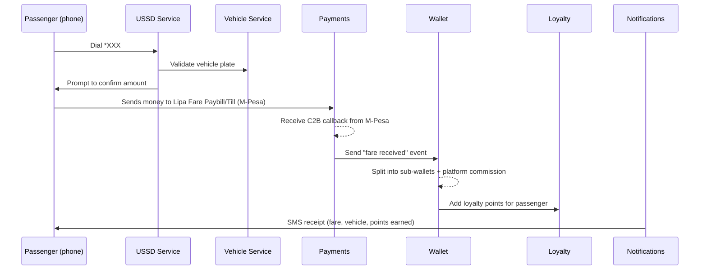

# Lipa Fare Beginner-Friendly System Architecture

This guide explains how the core pieces of Lipa Fare fit together in plain language. It highlights the essential journeys and the supporting services so new team members can quickly grasp how the platform works.

## 1) Big Picture

Lipa Fare links passengers, operators, and SACCOs through a few simple channels (USSD, passenger app, owner dashboard). Payments land through M-Pesa, are split into wallets automatically, and every action is recorded for transparency.

```mermaid
flowchart LR
    subgraph Channels
        USSD[USSD (*XXX#)]
        App[Passenger Mobile App]
        Owner[Owner/SACCO Web Dashboard]
    end

    subgraph Core Services
        APIGW[API Gateway]
        Auth[Auth & Users]
        Vehicle[Vehicle & SACCO]
        Wallet[Wallet & Ledger]
        Payments[Payments (M-Pesa)]
        Loyalty[Loyalty]
        Notify[Notifications]
        Reports[Reporting]
    end

    subgraph External
        MPesa[M-Pesa C2B/B2C]
        SMS[SMS Gateway]
        Bank[Banks]
    end

    USSD --> APIGW
    App --> APIGW
    Owner --> APIGW

    APIGW --> Auth
    APIGW --> Vehicle
    APIGW --> Payments
    APIGW --> Wallet
    APIGW --> Loyalty
    APIGW --> Reports

    Payments --> MPesa
    Notify --> SMS
    Wallet --> Bank
```

## 2) Key User Journeys

### A. USSD Fare Payment (passenger on any phone)


**Why it matters:** Works on any phone, keeps steps short (<180s), and uses M-Pesa as the trusted cash-in.

### B. M-Pesa C2B Integration (money in)
1. Passenger pays to your Paybill/Till with the vehicle plate as reference.
2. M-Pesa sends a secure callback (C2B) to the Payments service.
3. Payments validates the transaction (amount, MSISDN, receipt number, plate).
4. Payments emits an event to Wallet for posting and splitting.
5. Wallet posts a double-entry ledger transaction and allocates to sub-wallets.
6. Notifications sends an SMS confirmation to the passenger (and optionally the owner).

### C. Wallet & Sub-Wallet Splits (money handling)
* Every vehicle/owner has a **main wallet** plus **sub-wallets** (fuel, maintenance, SACCO, insurance/loan, profit).
* Each fare creates a ledger entry that balances debits and credits.
* Splits are driven by the percentages defined for the vehicle/SACCO (e.g., 10% fuel, 5% SACCO, 20% loan, remainder profit).
* Owners can view balances per sub-wallet and request payouts to M-Pesa or bank.

**Ledger rule:** Every transaction must be immutable and balanced (total credits = total debits) to make reconciliation easy.

### D. Loyalty Points (keep passengers returning)
* Earn: e.g., 1 point per KSh 10 fare (configurable). Posted when Wallet confirms the fare.
* Redeem: Passenger chooses to pay with points (USSD or app). Wallet creates an internal credit so the vehicle still gets paid.
* View: Passengers see points balance and last redemptions on USSD or the app.

### E. Owner Dashboard (web)
* Overview: today/week/month collections by vehicle/route.
* Wallets: balances for main and sub-wallets; request withdrawals.
* Transactions: searchable ledger and downloadable CSV/PDF.
* Controls: update vehicle splits, add drivers, set routes.

### F. Passenger Mobile App (Android-first)
* Quick pay: enter plate or scan QR to start M-Pesa STK push.
* History: recent trips and receipts.
* Loyalty: current points and redemption flow.
* Help: support contacts and FAQs.

### G. SACCO Admin Controls
* Approvals: verify vehicles/drivers before activation.
* Oversight: collections by route/vehicle; exception flags (e.g., unusual drops).
* Config: default split templates, commission settings, fare guidance per route.
* Reporting: export manifests/statements for compliance.

## 3) Data Anchors (minimum viable tables)
* **users**: phone, role (passenger/owner/driver/SACCO/admin), KYC info.
* **vehicles**: plate, owner_id, sacco_id, route, active status.
* **wallets** & **wallet_accounts**: main wallet per vehicle/owner; sub-wallets with percentages.
* **transactions** (ledger): immutable entries; links to vehicle, user, channel, and split details.
* **loyalty_accounts**, **loyalty_transactions**: earn/redeem history.
* **ussd_sessions**: short-lived state for menus.

## 4) Security and Reliability Basics
* **Auth**: OTP + JWT tokens; RBAC for passenger/owner/SACCO/admin.
* **Idempotency**: ignore duplicate M-Pesa callbacks using receipt numbers.
* **Auditability**: immutable ledger + timestamped actions.
* **Resilience**: queue events (e.g., Kafka/RabbitMQ) so wallet posting and notifications retry safely.
* **Privacy**: encrypt sensitive data in transit (HTTPS) and at rest (DB encryption where possible).

## 5) What to Build First (MVP slice)
1) USSD payment flow with M-Pesa C2B callback.
2) Wallet posting + sub-wallet splits + platform commission.
3) Loyalty accrual + SMS receipt.
4) Owner dashboard: balances and recent transactions.
5) Basic SACCO admin approvals.
6) Passenger app: simple pay + history + points (Android-first).

This sequence keeps the team focused on a single reliable cash-in path while delivering visibility and incentives to both riders and operators.
