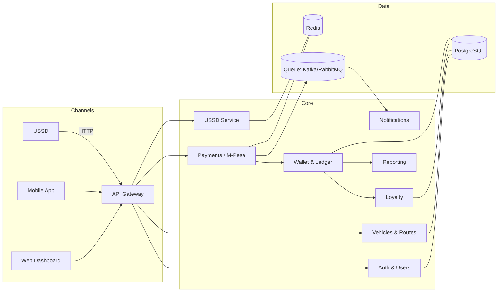

# Lipa Fare Technical Documentation (Beginner-Friendly)

This document explains how the Lipa Fare platform works and how to deploy it. It is written for non-developers and new team members who need a clear, end-to-end picture.

## 1) System Architecture

**Big picture:**
- Channels: USSD, passenger mobile app, owner/SACCO web dashboard, and admin tools.
- Core services: Authentication, Vehicles & routes, Payments (M-Pesa), Wallet & Ledger, Loyalty, USSD menus, Notifications, and Reporting.
- Integrations: Safaricom M-Pesa (C2B, B2C, B2B), USSD gateway, SMS gateway, banks/paybill/till partners.

**Key ideas:**
- USSD and mobile/web clients all call the same backend APIs through an API gateway.
- Payments enter through M-Pesa C2B callbacks; payouts use B2C/B2B.
- Wallet & Ledger enforce double-entry accounting and apply fare splits and commission in real time.
- Redis stores short-lived USSD sessions; PostgreSQL stores long-lived data and the immutable ledger.
- A message queue fans out payment events to notifications and reporting.

## 2) APIs (high level)
The backend follows REST with JSON responses. Important routes:

### Auth & Users
- `POST /auth/register` – create a user with phone number and role (passenger, owner, sacco-admin).
- `POST /auth/login` – login via phone + OTP (stubbed in MVP).
- `GET /users/me` – return profile and roles.

### Vehicles & Routes
- `POST /vehicles` – register a vehicle with plate, owner, SACCO, and split rules (fuel, maintenance, SACCO, insurance, loan, profit).
- `GET /vehicles/:plate` – fetch vehicle details and configured splits.

### Payments (M-Pesa)
- `POST /payments/mpesa/c2b/confirm` – Safaricom callback for received fare; validates reference, logs passenger MSISDN, and forwards to wallet for allocation.
- `POST /payments/mpesa/c2b/validate` – optional pre-validation hook.
- `POST /payments/mpesa/b2c` – initiate payout to a phone (owner withdrawal or vendor payment).
- `POST /payments/mpesa/b2b` – initiate payout to paybill/till/bank account.

### Wallet & Ledger
- `GET /wallets/:vehiclePlate` – balances for master wallet and all sub-wallets.
- `POST /wallets/:vehiclePlate/fare` – internal endpoint used after C2B to apply splits and record double-entry ledger lines.
- `POST /wallets/:vehiclePlate/withdraw` – create a withdrawal request (routes to B2C/B2B service).

### Loyalty
- `GET /loyalty/:userId` – current points and recent redemptions.
- `POST /loyalty/:userId/redeem` – redeem points to fund a fare credit.

### USSD
- `POST /ussd` – single entry point the telco calls every time a user presses a key; uses Redis to keep session state and returns the next menu text.

## 3) Database (PostgreSQL overview)
Tables are simple and human-readable:
- `users` – phone, role, status; linked to passengers, owners, and SACCO admins.
- `saccos` – name, contact, status.
- `vehicles` – plate, owner_id, sacco_id, route info.
- `split_rules` – percentages for fuel, maintenance, sacco, insurance, loan, profit, commission.
- `wallets` – one per vehicle/owner plus platform control accounts.
- `wallet_accounts` – sub-wallets (fuel, maintenance, sacco, insurance, loan, profit, commission, loyalty pool, clearing).
- `ledger_entries` – immutable double-entry rows with debit_account_id, credit_account_id, amount, currency, reference, and actor (e.g., passenger MSISDN).
- `payments` – raw M-Pesa payloads and status for C2B, B2C, B2B.
- `loyalty_accounts` and `loyalty_transactions` – points balances and movements.
- `ussd_sessions` – sessionId, phoneNumber, menu state, expiry.
- `vendors` – partner records (fuel, insurance, spares) for payouts.

## 4) USSD Flow (short menus)
- **Passenger fare payment:**
  1. Dial short code → choose “Pay Fare”.
  2. Enter vehicle plate → enter amount.
  3. Receive prompt to pay via M-Pesa STK (or send to paybill with plate as account reference).
  4. Get confirmation SMS with fare amount and loyalty points earned.

- **Loyalty redemption:**
  1. Dial short code → “Redeem Points”.
  2. Enter vehicle plate → confirm points to use.
  3. System creates an internal credit transaction; passenger gets confirmation SMS.

- **Owner wallet balances:**
  1. Dial short code → “Owner Login” (phone + PIN/OTP).
  2. View totals for master wallet and sub-wallets; option to request withdrawal.

- **Quick vehicle registration:**
  1. Dial short code → “Register Vehicle”.
  2. Enter plate, SACCO, and split percentages.
  3. System provisions wallets and confirms via SMS.

## 5) Mobile App (React Native)
- **Login:** phone + OTP; stores a session token.
- **Pay fare:** enter plate (or scan QR in future) → triggers M-Pesa STK push → app shows success and points earned.
- **Trip history:** list of recent fares with plate, route, and amount.
- **Loyalty points:** current balance and earned/used list.
- **Redeem:** choose plate, pick points to use, and confirm.

## 6) Web Dashboard (Next.js)
- **Dashboard overview:** collections today/this week, top vehicles, alerts.
- **Vehicles & routes:** add/update vehicles, drivers, and split rules.
- **Wallet balances:** master + sub-wallets with filters by vehicle.
- **Sub-wallet breakdown:** percentages, recent movements, and adjust rules (with audit trail).
- **Withdrawals:** request payouts to M-Pesa (B2C) or paybill/bank (B2B); track status.
- **Reports & statements:** download CSV/PDF for collections, payouts, and loyalty usage by date range.

## 7) Deployment Guide (Docker + AWS)
- **Build images:**
  - Backend: `docker build -t lipa-fare-backend ./backend`
  - Dashboard: `docker build -t lipa-fare-dashboard ./next-dashboard`
- **Push to registry:** create ECR repositories and push both images.
- **Run on ECS Fargate:**
  - One service/task for backend behind an Application Load Balancer (HTTP 80/443).
  - One service/task for the dashboard behind its own listener/target group.
  - Attach RDS PostgreSQL, ElastiCache Redis, and set environment variables for M-Pesa credentials and secrets.
- **Domains & TLS:** use Route 53 + ACM certificates for `api.example.com` and `app.example.com`.
- **Callbacks:** configure Safaricom C2B validation/confirmation URLs to point to the backend ALB HTTPS endpoints.
- **Monitoring:** enable CloudWatch logs/metrics; add alarms for error rates and high latency.
- **Backups & DR:** enable RDS automated backups and snapshot policy; version S3 artifacts (reports/logs).

## 8) How everything fits together (one simple story)
1. Passenger dials USSD or opens the app, enters a vehicle plate, and pays via M-Pesa.
2. M-Pesa sends a C2B callback to the backend, which validates and records the payment.
3. Wallet service splits the fare into sub-wallets, posts double-entry ledger rows, and credits loyalty points.
4. SMS/notifications confirm the payment; owners see live balances on the dashboard.
5. Owners request withdrawals or pay vendors; payouts go through B2C/B2B and are ledgered the same way.
